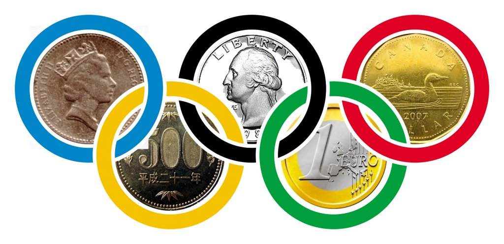

# Olympic-Medals-vs-GDP



## Context

Els elements d'aquest repositori constitueixen la resposta a la PRÀCTICA de l'assignatura *Visualització de dades* del *Màster en Ciència de Dades* de la [Universitat Oberta de Catalunya](https://www.uoc.edu/portal/ca/index.html) (UOC), corresponent al segon semestre del curs 2023-2024.

L'objectiu és implementar un projecte de visualització de dades que reculli tot l'aprenentatge adquirit a través dels continguts estudiats al llarg del curs.

## Lliurable principal de la pràctica

El lliurable principal de la pràctica és un vídeo que implementa un *storytelling* que reflexiona sobre la relació entre el nivell esportiu d'un país, mesurat per les medalles olímpiques aconseguides en els jocs d'estiu del 1960 al 2020, i el seus PIB i PIB per càpita.

## Fonts de dades

Les fonts de dades són el [Comitè Olímpic Internacional (IOC)](https://olympics.com/ioc) i el [Banc Mundial (WB)](https://www.worldbank.org/), a través dels següents conjunts de dades (*datesets*):
- IOC: [indirectament a través d'aquest dataset de Kaggle](https://www.kaggle.com/datasets/piterfm/olympic-games-medals-19862018)
- WB: [PIB](https://datos.bancomundial.org/indicador/NY.GDP.MKTP.CD) i [PIB per càpita](https://datos.bancomundial.org/indicador/NY.GDP.PCAP.CD)

## Accés a les històries de Flourish

El vídeo es basa en dues històries desenvolupades amb l'eina [Flourish](https://flourish.studio/), accessibles de manera pública a les següents ubicacions:
- [Olympic Medals vs GDP (Part I)](https://public.flourish.studio/story/2389611/)
- [Olympic Medals vs GDP (Part II)](https://public.flourish.studio/story/2435673/)

## Repositori

El projecte es troba en [aquest repositori públic de GitHub](https://github.com/ngonzalezs-UOC/Olympic-Medals-vs-GDP), i la seva estructura és la següent: 

```bash
────Olympic-Medals-vs-GDP
    │
    ├───Dev
    │        *.*
    │
    ├───Data
    │   │     
    │   ├─── Source
    │   │        *.*
    │   └─── Output
    │            *.*
    │
    ├─── LICENSE
    ├─── README.md
    └─── banner-readme.png 

```
- **Dev/\*.\***: Documents amb el codi relatiu al processament de les dades, realitzats en Python3 sobre Jupiter Notebook.
- **Data/Source/\*.\***: Fitxers corresponents als datasets de les fonts de dades.
- **Data/Output/\*.\***: Fitxers generats a partir de les fonts de dades i que constitueixen (directament o indirectament) els datasets d'entrada a les diferents visualitzacions en Flourish.
- **LICENSE**: Document amb els termes de la llicència aplicada al projecte.
- **README.md**: Document explicatiu del projecte.
- **banner-readme.jpg**: Imatge (banner) incrustada a la capçalera del fitxer README.md.

## Autoria

Totes i cadascuna de les parts d'aquest treball han estat realitzades exclusivament de forma individual per **Nicolás González Soler**.

## Llicència

Shield: [![CC BY-NC-SA 4.0][cc-by-nc-sa-shield]][cc-by-nc-sa]

Tots i cadascun dels continguts d'aquest projecte estan sotmesos a la llicència
[Creative Commons Attribution-NonCommercial-ShareAlike 4.0 International License][cc-by-nc-sa], excepte pel que respecta als datasets emprats sobre els que caldria observar les llicències eventualment preexistents que són d'aplicació.

[![CC BY-NC-SA 4.0][cc-by-nc-sa-image]][cc-by-nc-sa]

[cc-by-nc-sa]: http://creativecommons.org/licenses/by-nc-sa/4.0/
[cc-by-nc-sa-image]: https://licensebuttons.net/l/by-nc-sa/4.0/88x31.png
[cc-by-nc-sa-shield]: https://img.shields.io/badge/License-CC%20BY--NC--SA%204.0-lightgrey.svg
